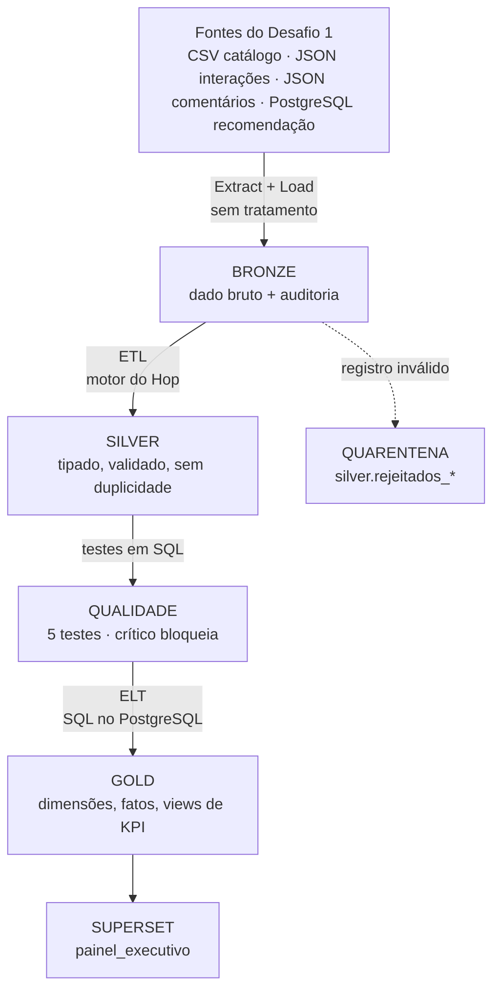

# Arquitetura ETL/ELT (RF19)

O pipeline do Desafio 2 é **híbrido**: usa **ETL** onde todo o dado precisa ser
validado antes de ser confiável (Bronze → Silver, no Apache Hop) e **ELT** onde
o banco já tem o dado limpo e só a fatia de interesse precisa ser modelada
(Silver → Gold, em SQL dentro do PostgreSQL). A decisão é de arquitetura; a
ferramenta (Hop) executa os dois padrões.

## 1. Visão geral

Fora do fluxo principal: a Silver de interações é exportada em **Parquet** e
processada pelo **Apache Beam** (local, Direct e Spark), e o workflow publica
metadados e linhagem no **OpenMetadata** (seções 5 e 6).

| Camada | Schema | Padrão | Onde transforma | Estratégia de carga |
|---|---|---|---|---|
| Bronze | `bronze` | E + L (sem T) | não transforma: grava como chegou, em texto, com `origem`, `data_hora_ingestao` e `id_execucao` | completa, a cada execução |
| Silver | `silver` | **ETL** | motor do Hop (transforms: trim, validação, conversão, deduplicação) | completa, *truncate + insert* |
| Qualidade | `qualidade` | ELT | SQL no PostgreSQL (`sql/04_executar_testes_qualidade.sql`) | um registro por teste e execução |
| Gold | `gold` | **ELT** | SQL no PostgreSQL (`Table input` com a consulta, `Table output` grava) | completa, *truncate + insert* |
| Consumo | `gold` (views) | ELT sob demanda | views `vw_kpi_*` e datasets virtuais do SQL Lab | calculado na leitura |

## 2. Por que ETL na Silver

- **Todo registro precisa passar pelas regras** antes de ser usado: tipos, domínios,
  datas, faixas e integridade referencial (regras em `rf21_regras_silver.md`).
  É o cenário do BI tradicional: *schema-on-write*, nada entra na Silver sem
  estrutura garantida.
- A validação precisa de **tratamento por linha com desvio**: o que falha vai para a
  quarentena com código, campo e motivo, sem parar a carga (RF23). O
  *error handling* do Hop faz isso de forma visual e auditável; em SQL puro seria
  preciso reescrever a mesma lógica em cada consulta.
- O volume é pequeno (1.000 a 2.250 linhas por fonte), então processar tudo a cada
  carga é barato.

## 3. Por que ELT na Gold

- Na Gold o dado **já está limpo e dentro do banco**. Trazer tudo para o Hop, agregar e
  devolver seria mover dados à toa; o PostgreSQL faz junções e agregações no
  próprio lugar.
- A Gold transforma **só a fatia de interesse**:
  - `fato_recomendacao` usa **apenas o lote mais recente** das 3 gerações de
    recomendação que existem na Silver;
  - `dim_usuario` marca `usuario_ativo` pela janela de 30 dias;
  - as views de KPI calculam taxa de conclusão e conversão na hora da consulta.
- As consultas ficam versionadas em SQL (`sql/05_criar_tabelas_gold.sql` e as
  consultas dos pipelines `gold_*`), legíveis para quem mantém o dashboard.

## 4. Conceitos operacionais aplicados

| Conceito | Como aparece no projeto |
|---|---|
| Staging area | a **Bronze** faz o papel de *staging*: guarda o extraído sem tratamento; dá para reprocessar a Silver sem voltar às fontes |
| Dado bruto preservado | sim, na Bronze (característica do ELT, mantida mesmo com Silver em ETL) |
| Idempotência | Silver e Gold com *truncate + insert*; tabelas e schemas criados com `IF NOT EXISTS`; rodar a carga duas vezes dá o mesmo resultado |
| Carga completa x incremental | **completa**, pelo volume pequeno. Com volume grande, a evolução natural é incremental pela data (`data_hora` das interações, `data_geracao` das recomendações) |
| Quarentena | `silver.rejeitados_*`; nenhum registro some sem motivo (RF23) |
| Portão de qualidade | testes CRÍTICOS reprovados **bloqueiam** a Gold; ALERTAS deixam a carga "com ressalvas" (RF31) |
| Rastreabilidade | o mesmo `id_execucao` em Bronze, Silver, quarentena, qualidade e Gold; duração por etapa em `auditoria.log_etapas` (RF22) |

## 5. Escala: o mesmo pipeline em runtimes diferentes

Para o cenário Big Data, a Silver de interações é exportada em **Parquet**
(colunar, compactado: 19 KB contra 108 KB em CSV) e processada pelo pipeline
`engajamento_beam.hpl` **sem alteração** em três runtimes: `local` (motor do Hop),
`beam-direct` (Apache Beam) e `spark-local` (Beam sobre Spark). Os três produzem o
mesmo resultado (RF24–RF25). No volume atual o motor local é o mais rápido
(7,7 s contra 66 s do Spark); o Spark se justifica quando o dado não cabe numa
máquina ou não cabe na janela de tempo.

## 6. Orquestração, consumo e governança

- **Orquestração:** workflow `carga_completa.hwf`, execução manual (`scripts/executar_carga_completa.bat`)
  ou agendada (Agendador de Tarefas, diariamente às 06:00). Três estados finais:
  sucesso, sucesso com ressalvas e falha (RF22).
- **Consumo:** Apache Superset lê **somente** `gold` e `qualidade` com o usuário
  `superset_leitura`; a Bronze e a Silver ficam inacessíveis ao dashboard (RF26).
- **Governança:** a etapa *Publicar metadados* do workflow atualiza catálogo,
  glossário e linhagem no OpenMetadata; se o serviço estiver fora do ar, a carga
  segue com ressalva (RF22, RF27–RF29).

## 7. Riscos e decisões

| Risco | Decisão |
|---|---|
| Rigidez do ETL (toda regra nova exige mudar o pipeline) | regras concentradas num único transform por pipeline (*Validar regras*), com códigos de erro padronizados |
| "Pântano de dados" do ELT | Bronze com auditoria, dados catalogados e com linhagem no OpenMetadata |
| Carga completa não escala | volume atual comporta; caminho incremental definido na seção 4 |
| Falha no meio da carga | o workflow para no primeiro erro e não publica a Gold; como tudo é recalculado, basta rodar de novo |
